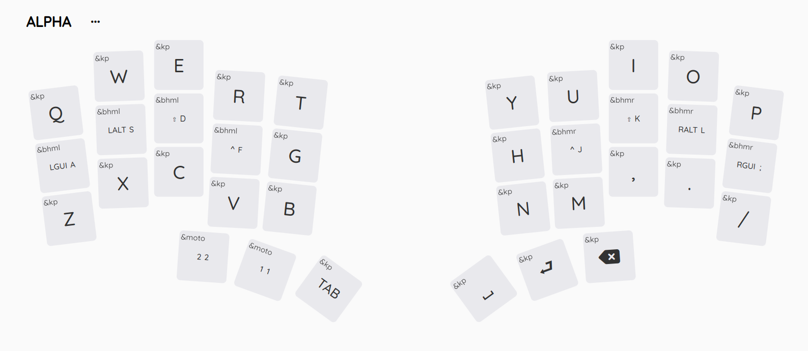

# Armadillo1

It all started with a [Talk by ink](https://media.ccc.de/v/gpn22-498-tastaturen-ein-drama-mit-10-fingern) at GPN22, which inspired me to build my own customized wireless split keyboard. This one is fitted to the exact size of my hands and features a 36 key layout.

## Layout

I used [ergopad](https://pashutk.com/ergopad/) to determine the exact poitions of my fingertips that feel most comfortable. Then, I replicated the resulting layout manually using [ergogen](https://ergogen.ceoloide.com/).

## Keymap

For more details, see the [keymap README](keymap/README.md).

## Controller & Display

[nice!nano](https://nicekeyboards.com/nice-nano/) and [nice!view](https://nicekeyboards.com/nice-view).

## Switches

Kailh MX Jade. They're clicky switches with an above-average activation force.

## Keycaps

Smolo Keycaps from [BeeKeeb](https://shop.beekeeb.com/product/smolo-low-profile-keycap/).

## Risers

Self-printed. The design is available on [MakerWorld](https://makerworld.com/en/models/809248#profileId-750244).

## Case

Self-printed. I'm not yet fully satisfied by the design, so it's not yet published. If you're actually interested to print one yourself, please poke me.

## Stands

Two [MagSafe Stands](https://de.ugreen.com/products/45378?_pos=28&_sid=3c43091c2&_ss=r) by Ugreen.