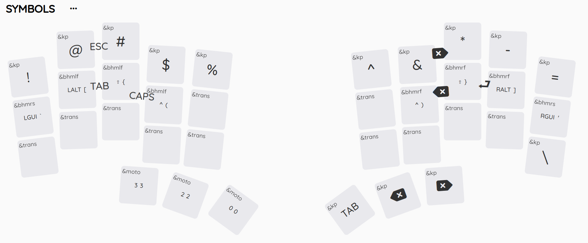
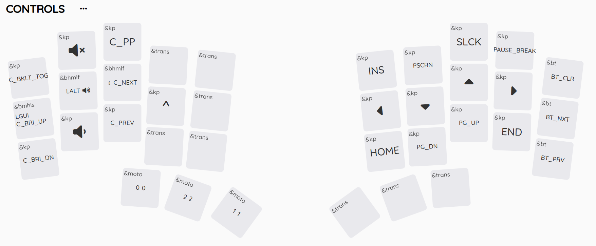

# Armadillo Keymap

## How to use

### armadillo.keymap

The keymap configuration to include in your zmk config.

### armadillo-keymap-layout.json

You can import this file along with `armadillo.keymap` to [nickcoutsos.github.io](https://nickcoutsos.github.io/keymap-editor/) for a nice visualization of the layout. However, this tool doesn't pick up key combos. I visualized them by hand in the `symbols` layer by adding an icon between two keys. The combos are available in any layer.

The full `zmk` config can be found over at [rngcntr/zmk-config](https://github.com/rngcntr/zmk-config).
**WARNING**: The pin config differs from the one defined by the PCB by *one pin*, because the pin in question was damaged on my controller. I only noticed this once the PCB was already produced. Flashing this version without modification will cause one column to be ignored.